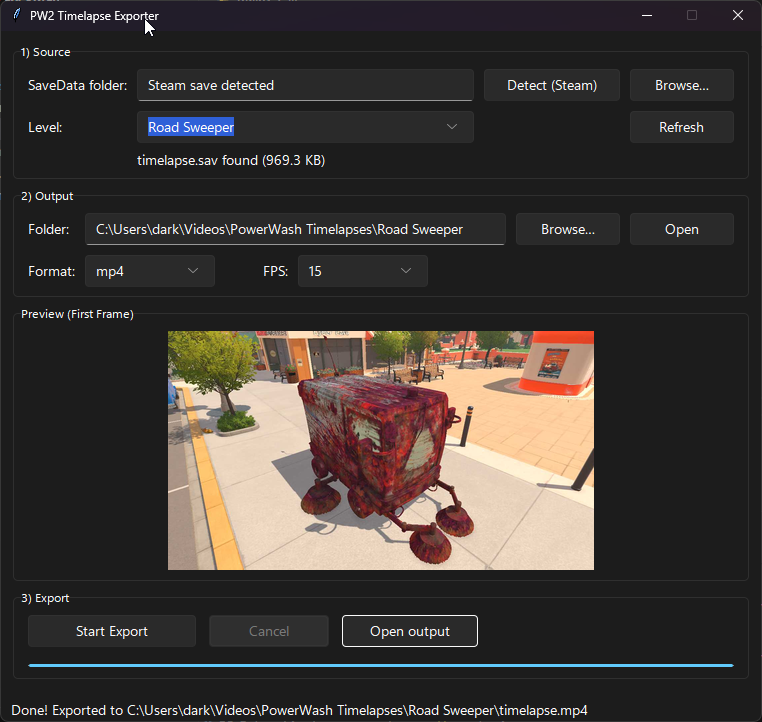

# PW2 Timelapse Exporter (GUI)

Export PowerWash Simulator 2 timelapses into **MP4** or **GIF**.  
Pick your SaveData folder, choose the level, hit **Start Export**.

---

## ▶️ Downloads (no Python needed)

Grab the latest Windows build from **Releases**:  
**[➡ Download the EXE from Releases](../../releases)**

> Tip: If SmartScreen warns about an unknown publisher, click **More info → Run anyway**. No admin rights required.

---

## 🖼️ Screenshot



---

## 🧭 How to Use

1. **Detect (Steam)** — the app will auto-find your SaveData folder.  
   (Or click **Browse…** and select it manually.)
2. **Pick a Level** — the dropdown only shows folders that contain a `timelapse.sav`.
3. **Start Export** — choose MP4 or GIF, then click **Start Export**.  
   When it’s done, click **Open output**.

That’s it.

---

## 🐍 Run from source (developers / power users)

**Requirements**
- Windows 10/11 (64-bit)
- Python **3.13+** from [python.org](https://www.python.org/downloads/) (check “Add to PATH”)

**Install**
```powershell
py -m pip install --upgrade pip
py -m pip install -r requirements.txt
```

**Run**
```powershell
py gui.py
```

---

## 🛠️ Troubleshooting


**SmartScreen / AV warnings**  
Normal for unsigned EXEs. 

---

## 📄 License

MIT 
